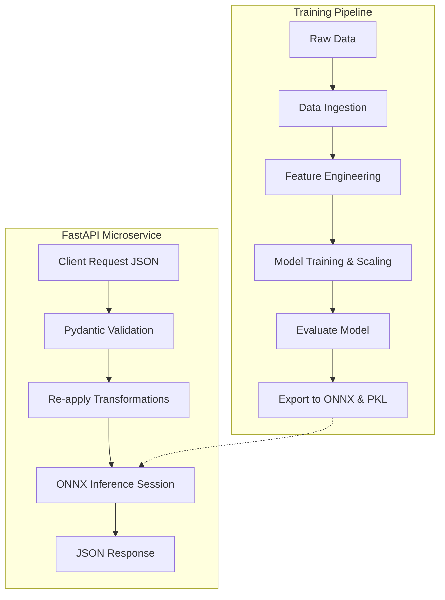

# Seoul Bike Demand Forecasting | Production-Grade MLOps & FastAPI Service

    

## Executive Summary
This repository implements a Production-Oriented, modular Machine Learning pipeline and serving layer for forecasting hourly bike rental demand in Seoul. The project separates data ingestion, feature engineering, model training, and serving into distinct modules so models can be trained, evaluated, serialized to ONNX, and served via a typed FastAPI microservice.

## Business Problem
Urban bike-sharing systems need accurate short-term forecasts to balance inventory and reduce unmet demand. This project predicts hourly bike rentals using weather and temporal features (e.g., temperature, humidity, hour, month, holidays, seasonality), enabling operational rebalancing decisions.

## Solution Architecture
The codebase splits responsibilities between a retrainable MLOps pipeline and a lightweight inference service.



## Machine Learning Pipeline
The training pipeline at `src/pipeline/train.py` performs a deterministic end‑to‑end workflow:

- Ingestion: load and normalize raw CSV headers.
- Feature engineering: create cyclical encodings, flags, interaction terms, and one-hot encodings consistent with serving logic.
- Scaling: fit a `StandardScaler` and persist it (`scaler.pkl`).
- Training: train `MLPRegressor` (configured in `src/config.py`).
- Evaluation: compute RMSE and R² on a held-out test set.
- Serialization: export the trained Scikit-Learn model to ONNX (`model.onnx`) for lightweight inference.

### Key Feature Engineering
- Cyclical encodings: `Hour` and `Month` → `Hour_Sin`, `Hour_Cos`, `Month_Sin`, `Month_Cos`.
- Peak-hour flag: `Is_Peak_Hour` for commuting windows (8, 18, 19).
- Interaction term: `Temp_Humidity_Interaction = Temperature * Humidity`.
- Categorical context: maps days/holiday info into `Day_Type` (Work vs Leisure) and seasonal one-hot columns.

## Model Performance (example)
- R²: 0.9264
- RMSE: 173.53

(These are representative benchmark numbers from the model evaluation stage — actual results depend on data and training runs.)

## Engineering Decisions

- **Project structure:** separates training (`src/pipeline`) from serving (`src/api`) for maintainability.
- **API framework:** FastAPI for built-in validation, async support, and auto-generated docs.
- **Inference engine:** ONNX Runtime to decouple training dependencies from production inference.
- **Packaging / installer:** `uv` (fast installer) is used in the provided Dockerfile for faster dependency install.
- **Security:** Docker image runs under a non-root user and exposes only port 8000.
- **Validation:** Pydantic schemas (`src/api/schemas.py`) validate inputs before they reach preprocessing or the model.

## Repository Structure

```
.
├── data
│   ├── processed/        # post-engineering datasets
│   └── raw/              # immutable raw datasets (SeoulBikeData.csv)
├── models                # serialized production artifacts
│   ├── model.onnx
│   └── scaler.pkl
├── notebooks
│   └── 01_exploratory_data_analysis.ipynb
├── src
│   ├── api               # serving layer
│   │   ├── main.py       # FastAPI application
│   │   └── schemas.py    # Pydantic models for request/response
│   ├── pipeline          # training layer
│   │   ├── data_ingestion.py
│   │   ├── features.py
│   │   ├── evaluate.py
│   │   └── train.py
│   └── config.py         # centralized paths and model params
├── Dockerfile            # container build for serving
├── requirements.txt      # dependency manifest
└── README.md
```

## Quick Start (Local)

### Prerequisites
- Python 3.11+
- Recommended (optional): `uv` for fast installs (see Dockerfile usage)

### 1. Create & activate environment
```bash
python -m venv .venv
source .venv/bin/activate
pip install -r requirements.txt
```

(If you use `uv` instead of `pip`, the Dockerfile shows `uv pip install -r requirements.txt`.)

### 2. (Optional) Retrain the model
This regenerates `data/processed/processed_data.csv`, `models/scaler.pkl`, and `models/model.onnx`:
```bash
python -m src.pipeline.train
```

### 3. Run the API locally
```bash
uvicorn src.api.main:app --host 0.0.0.0 --port 8000 --reload
```
Open the interactive docs at: `http://127.0.0.1:8000/docs`

## Docker Deployment
Build and run the provided container image:
```bash
docker build -t bike-demand-api .
docker run -p 8000:8000 bike-demand-api
```
The container uses a slim Python base, installs dependencies, copies `models/` and `src/`, and runs Uvicorn on port 8000 as a non-root user.

## API Reference

**Endpoint:** `POST /predict`  
**Request body:** see `src/api/schemas.py` for exact fields and validation constraints.

Example payload:
```json
{
  "Temperature": 28.5,
  "Humidity": 55.0,
  "Wind_Speed": 1.5,
  "Visibility": 2000,
  "Solar_Radiation": 1.2,
  "Rainfall": 0.0,
  "Snowfall": 0.0,
  "Hour": 8,
  "Month": 7,
  "Season": "Summer",
  "Day_Type": "Work",
  "Holiday": "No Holiday",
  "Functioning_Day": "Yes"
}
```

cURL example:
```bash
curl -X POST "http://127.0.0.1:8000/predict" \
  -H "Content-Type: application/json" \
  -d '{
    "Temperature": 28.5,
    "Humidity": 55.0,
    "Wind_Speed": 1.5,
    "Visibility": 2000,
    "Solar_Radiation": 1.2,
    "Rainfall": 0.0,
    "Snowfall": 0.0,
    "Hour": 8,
    "Month": 7,
    "Season": "Summer",
    "Day_Type": "Work",
    "Holiday": "No Holiday",
    "Functioning_Day": "Yes"
  }'
```

Example response:
```json
{
  "expected_bike_demand": 1871,
  "message": "Prediction calculated successfully"
}
```

## Maintenance & Notes
- Keep the feature engineering logic in `src/pipeline/features.py` and the transformation logic in `src/api/main.py` synchronized (column order matters for the saved scaler and ONNX model).
- Consider restricting categorical inputs to enums in `src/api/schemas.py` to avoid unexpected one-hot encodings at inference time.
- When retraining, verify `data/processed/processed_data.csv` is backed up if you need reproducibility for experiments.
- Add a `.dockerignore` to exclude raw data and local env folders from images.

## Where to look in the code
- Config and paths: [src/config.py](src/config.py)
- API server: [src/api/main.py](src/api/main.py)
- Request/response models: [src/api/schemas.py](src/api/schemas.py)
- Data ingestion: [src/pipeline/data_ingestion.py](src/pipeline/data_ingestion.py)
- Feature engineering: [src/pipeline/features.py](src/pipeline/features.py)
- Training & export: [src/pipeline/train.py](src/pipeline/train.py)
- Model evaluation: [src/pipeline/evaluate.py](src/pipeline/evaluate.py)

---
